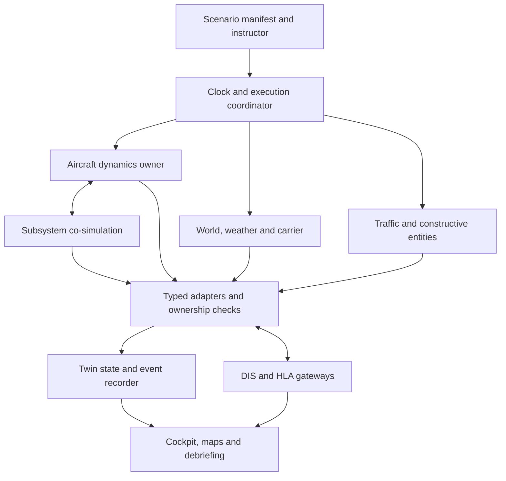

# jfxjts

## OpenTwin Flight --- Open Flight Training & Mission Simulation Platform

> Open-source reference architecture and technology compendium for
> AI-assisted pilot training, mission rehearsal, distributed simulation,
> Modelica-based multidomain engineering, modular aircraft digital
> twins, and interoperable training environments.

**jfxjts** consolidates an open engineering architecture for flight
training and mission simulation using **MBSE, flight dynamics,
Modelica/FMI, HLA/distributed simulation, ROS 2/DDS, AI, digital twins,
synthetic environments, and modular mission interfaces**.

## Vision

**MBSE + Flight Simulation + Modelica/FMI + Distributed Simulation +
Digital Twins + AI**

The platform emphasizes open architecture, replaceable simulation
engines, multi-fidelity aircraft models, reproducible scenarios,
human-in-the-loop experimentation, AI-assisted instruction, and
technology independence.

## Objectives

-   Integrate MBSE with executable flight and mission models.
-   Define modular OpenTwin Flight interfaces.
-   Support replaceable flight-dynamics engines.
-   Support Modelica and FMI/FMU for multidomain subsystems.
-   Support HLA and message-oriented distributed simulation.
-   Connect telemetry to digital twins.
-   Support AI-assisted training, evaluation, and diagnostics.
-   Enable reusable mission scenarios and multi-vehicle simulation.
-   Separate core architecture, optional integrations, and research
    references.

## Reference Architecture

**Status:** this repository defines an integration architecture. The adapters,
execution profiles, schemas, and validation gates below are proposed work,
not a claim that the listed products already interoperate in jfxjts.
Source descriptions were reviewed on 2026-09-20; every implementation must
pin its own versions and verify licenses and dependencies.



| Layer | Responsibility | Candidate components |
| --- | --- | --- |
| Engineering and configuration | Requirements, model registry, scenario versions, interface selection | MBSE, MOSA principles, Modelica, explicitly selected OMS profiles |
| Aircraft physics | One authoritative dynamics model per aircraft | FlightGear/JSBSim, PSim-RCAM, AeroSim, qualified research models |
| Subsystems | Energy, propulsion, actuators and avionics coupled at declared boundaries | Modelica/FMU, simulated avionics, cockpit adapters |
| Synthetic world | Terrain, atmosphere, moving decks, traffic and constructive entities | FlightGear, BlueSky, OpenEaagles |
| Experiment coordination | Simulation clock, lifecycle, input ownership and repeatable initialization | jfxjts coordinator to implement; Supercell as a candidate controller |
| Interoperability | Typed local interfaces, transport mappings and federation gateways | FMI, DIS, HLA/Portico, optional ROS 2/DDS |
| Twin and presentation | Time-stamped state, provenance, replay, visualization and assessment | OpenTwin Flight, Worldview, OpenSceneGraph, dashboards |

A renderer does not own aircraft dynamics unless explicitly selected as the
simulator. A traffic model does not replace a six-degree-of-freedom flight
model. A transport connection does not by itself establish semantic
interoperability. Offline simulation is a **virtual model**; a connected
digital twin additionally needs an identified asset, synchronized telemetry,
configuration tracking, and documented uncertainty.

### Integration contracts

| Contract | Required fields and behavior |
| --- | --- |
| Identity and provenance | Stable entity/model/scenario IDs, source revision, asset license, fidelity envelope, parameter checksum |
| Kinematics | Timestamp, position frame and datum, altitude reference, attitude convention, linear/angular velocity and units |
| Controls and ownership | Exactly one dynamics authority per entity; declared pilot, instructor or controller authority; explicit handover |
| Environment | Shared weather revision, simulation time, terrain/water datum and deck pose |
| Lifecycle | Configure, initialize, ready, run, pause, reset, stop; reject incompatible capabilities before execution |
| Events | Unique event ID, simulation timestamp, producer, entity references, type and schema version |
| Quality | Validity flag, uncertainty where known, stale-data age, dropped-message count and clock offset |
| Replay | Scenario seed, initial state, commands, events, model versions and reproducibility tolerance |

Use SI units at jfxjts adapter boundaries. Convert feet, knots, degrees and
model-specific units explicitly. Declare geodetic WGS84, ECEF, NED/ENU,
body and carrier-deck transforms; do not interpret them interchangeably.
Record quaternion ordering, handedness, and velocity reference frame.

## OpenTwin Flight

OpenTwin Flight is a technology-neutral digital-twin layer capable of
representing a virtual aircraft, connected simulator, experimental
aircraft twin, mission-training environment, or distributed simulation
federation.

``` text
Aircraft / Simulator / Synthetic Asset
                  |
        Telemetry & Input Adapters
                  |
           Semantic Data Layer
                  |
        OpenTwin Flight Interface Bus
        |          |           |
 Flight Model   Avionics    Environment
        +----------+-----------+
                   |
             Twin State
                   |
      Training | Monitoring | Analytics
                   |
            Instructor / AI
```

## Modular Digital Twin Interfaces

### Aircraft Interface

Identity, configuration, mass properties, geometry reference,
flight-dynamics adapter, propulsion adapter, avionics adapter, and
health state.

### Flight Dynamics Interface

``` text
initialize()
configure_aircraft()
set_environment()
set_controls()
step(dt)
get_kinematics()
get_dynamics()
get_state()
reset()
shutdown()
```

### Propulsion Interface

Supports conventional, electric, hybrid-electric, battery,
hydrogen-oriented conceptual, and distributed-propulsion research
models.

### Avionics Interface

Flight instruments, navigation, communications, autopilot, flight
management, synthetic avionics, and instructor-injected failures.

### Sensor Interface

GNSS, IMU, air data, radar altimeter, weather radar, cameras, LiDAR,
AIS/ADS-B, and synthetic sensors.

### Environment Interface

Atmosphere, wind, turbulence, weather, terrain, water surface,
visibility, and time/lighting.

### Mission Interface

Objectives, routes, waypoints, events, constraints, success/failure
criteria, and evaluation metrics.

### Telemetry Interface

``` text
aircraft.position.*
aircraft.altitude
aircraft.attitude.*
aircraft.velocity.*
propulsion.power
energy.soc
controls.*
mission.phase
training.score
health.index
```

### Pilot / Operator Interface

Cockpit controls, HOTAS, low-cost controllers, instructor stations,
remote operator stations, and experimental autonomous-agent interfaces.

### AI Agent Interface

AI modules can consume observations and produce recommendations,
instructor cues, scenario adaptation, or simulated actions.
Safety-critical real-world control is outside this training
architecture.

### FMI / FMU Interface

Portable subsystem models for propulsion, electrical systems, batteries,
thermal management, hydraulics, actuators, environmental control, and
control logic.

### HLA / Distributed Simulation Interface

``` text
Federation
├── Aircraft Federate
├── Environment Federate
├── Mission Federate
├── Instructor Federate
├── Sensor Federate
├── AI Federate
├── Recorder Federate
└── Visualization Federate
```

### Health Interface

Aircraft, propulsion, avionics, sensor, simulation, and network health
plus confidence and recommended training action.

### Scenario Interface

Versioned scenario packages define aircraft, environment, mission,
failures, events, and scoring profiles.

### Visualization Interface

3D simulators, instructor dashboards, GIS/map clients, Grafana, Jupyter,
and experimental AR/VR clients.

### Model Registry

Tracks model ID, version, fidelity, provenance, compatibility,
validation status, and license.

## Digital Twin Profiles

``` text
Minimal Flight Simulation Twin
              |
Connected Aircraft Twin
              |
Mission Training Twin
              |
AI-Assisted Training Twin
              |
Distributed Multi-Vehicle Twin
```

The progression moves from aircraft/environment simulation to telemetry
and health, mission/instructor/scoring services, AI-assisted assessment,
and finally distributed multi-aircraft training.

## Training and Mission Profiles

-   **General Flight Training:** procedures, navigation, weather,
    abnormal events, recurrent and instrument-oriented simulation
    research.
-   **Air Medical:** time-critical mission rehearsal, route planning,
    landing-zone scenarios, and crew workflow simulation.
-   **Search & Rescue:** search patterns, maritime/terrain scenarios,
    sensors, coordination, and rescue-support decisions.
-   **Humanitarian & Logistics:** remote connectivity, cargo, disaster
    response, constrained infrastructure, and multi-aircraft
    coordination.
-   **Research & Autonomy:** AI agents, optionally piloted concepts,
    human-machine teaming, and synthetic sensor evaluation.

## Distributed Simulation

Use local coupling first, then add distributed components when a scenario
requires them. DIS, HLA, FMI and ROS 2/DDS serve different purposes.

| Boundary | Proposed mapping | Qualification needed |
| --- | --- | --- |
| Flight model to twin | Model state/control adapter with lifecycle and timestamps | Units, frames, reset and control ownership |
| Modelica to coordinator | FMI Model Exchange or Co-Simulation, selected explicitly | FMI version, solver ownership, step size, algebraic loops and rollback support |
| DIS network | Entity state and selected event PDUs | DIS edition, entity types, dead reckoning, update rates and exercise IDs |
| HLA federation | Federate through Portico using a versioned FOM | HLA edition, API binding, time policy and attribute ownership |
| DIS to HLA | Dedicated semantic gateway | PDU/FOM mapping, entity IDs, ownership and loop prevention |
| Robotics messaging | Optional ROS 2/DDS adapter | QoS, namespaces, discovery and simulation-clock behavior |
| Geospatial viewer | State gateway to CZML or another declared viewer schema | Datum, interpolation, stale state and map licensing |

Portico is an HLA RTI, not an automatic DIS bridge. A FlightGear multiplayer
connection is not automatically DIS or HLA compatible. Worldview's reviewed
workflow uses a Graupel/CZML path and OMS-related messaging; a raw DIS feed
needs the appropriate upstream bridge.

Choose one clock authority. Real-time pilot interaction and accelerated
constructive runs are separate execution modes. Document late-event policy,
lookahead where applicable, pause/reset propagation, and reconnect behavior.
A viewer may interpolate remote entities but must not feed that interpolated
state back as authoritative physics. Assign a producer ID and suppress
message echoes at gateways.

### Proposed execution profiles

| Profile | Initial composition | Evidence required before enabling |
| --- | --- | --- |
| Civil flight baseline | FlightGear with a qualified DA42 asset, or PSim-RCAM with FlightGear visualization | Asset/FDM compatibility, trim and control-response checks |
| Multidomain aircraft | One flight model with Modelica subsystem FMUs | Stable coupling and unit/energy consistency |
| UAS research | Pegasus for supported multirotors; AMASE for its declared lower-fidelity mission model | Separate fidelity labels and runtime dependencies |
| Air traffic | BlueSky plus a traffic-state adapter and optional ATC display | Entity mapping and distinction between traffic and ownship dynamics |
| Distributed visualization | Supercell/JSBSim, DIS ingest bridge, Worldview | End-to-end coordinates, timestamps and identity checks |
| Carrier flight training | FlightGear aircraft/carrier pair and instructor/recorder adapters | Deck contact and asset-specific launch/recovery capabilities |
| Constructive mission simulation | OpenEaagles entities and scenario events, optionally federated | Matched framework/examples versions and synthetic scenario replay |

## FlightGear Carrier Integration

FlightGear provides carrier simulation infrastructure. Its
[carrier source](https://github.com/FlightGear/flightgear) includes
`src/AIModel/AICarrier.hxx`, with carrier scenario/parking support, deck
altitude, TACAN and FLOLS-related state. Actual launch, arresting, cockpit
indications and deck interaction depend on the selected aircraft, carrier,
data package and simulator version.

The proposed jfxjts carrier profile covers deck initialization, ground
handling, supported launch/recovery interactions, approach visualization,
instructor events and debriefing. Maintain an **aircraft/carrier capability
matrix**, rather than assuming every aircraft supports every carrier feature.

| Module | Twin interface | Validation focus |
| --- | --- | --- |
| Moving carrier | Carrier ID, world pose, deck transform and motion timestamp | Consistent aircraft/deck relative state |
| Deck surface | Geometry revision, contact surface and parking locations | Contact behavior and reset without penetration |
| Environmental coupling | Wind and shared water/world reference | Relative wind consistency across participants |
| Supported aids | Asset-defined navigation and visual approach aid state | Agreement between cockpit, carrier and renderer |
| Launch/recovery features | Explicit asset capability flags and abstract state transitions | Hook/arrestor or launch interaction only when implemented |
| Instructor and recorder | Pause, reset, weather presets and event history | Reproducible debrief and synchronization |

Start with one tested standalone aircraft/carrier pair. Add telemetry and
replay next; connect a remote carrier or federation only after transform,
latency and ownership tests pass. Keep STOBAR and CATOBAR capability profiles
separate, with unsupported features disabled.

### HAL TEDBF and INS Vishal context

[HAL TEDBF](https://en.wikipedia.org/wiki/HAL_TEDBF) and
[INS Vishal](https://en.wikipedia.org/wiki/INS_Vishal) are user-supplied
**secondary conceptual references** for an aircraft/carrier research profile.
They are not supplied FlightGear assets, validated performance models or
evidence of a tested aircraft/carrier pairing.

Use a clearly named generic naval-aircraft twin and generic carrier twin
until licensed geometry, public model data and validated interfaces are
available. Record unknowns explicitly, including flight dynamics, deck
configuration and launch/recovery compatibility. Do not derive a TEDBF model
from F-16 coefficients or infer CATOBAR compatibility from a concept image.

## OpenEaagles Constructive and Combat Simulation

[OpenEaagles](https://github.com/doughodson/OpenEaagles) is a C++ simulation
framework suitable for virtual and constructive applications. The proposed
jfxjts profile uses synthetic air/naval entities, simulated sensors,
abstract combat interactions, scenario events and instructor-led debriefing.
It remains a simulation architecture, not an implemented operational system.

[OpenEaaglesExamples](https://github.com/doughodson/OpenEaaglesExamples)
provides cockpit and simulation examples, including JSBSim-oriented examples.
Select matching framework and example revisions. The successor
[MIXR](https://www.mixr.dev/) should be evaluated as a separate versioned
candidate; names and APIs must not be assumed interchangeable.

| Component | Proposed responsibility | Boundary |
| --- | --- | --- |
| Entity adapter | Publish synthetic aircraft/ship identity and state | One dynamics owner per entity |
| Sensor adapter | Time-stamped synthetic observations with model/fidelity metadata | Distinguish observation from ground truth |
| Scenario service | Configure exercise participants and scripted events | Versioned synthetic scenarios |
| Interaction adapter | Record abstract exercise interactions and outcomes | Event schema and provenance, independent of rendering |
| Instructor service | Start, pause, reset and inspect the exercise | Explicit control authority |
| Federation gateway | Exchange supported entity/event data | Qualified DIS mapping or separately implemented HLA adapter |
| Recorder/debrief | Correlate state, observations and events | Reproducible timeline and documented limitations |

FlightGear may provide a pilot-facing view while OpenEaagles owns selected
constructive entities. Avoid running two dynamics engines for the same
aircraft. This connection requires new adapters and tests; no turnkey
FlightGear–OpenEaagles–Portico integration is claimed.

B-ACE is a separate research environment with its own abstractions, not an
interchangeable OpenEaagles backend. The reviewed QF-4E project does not
establish the requested full CCA/OODA capability; that description remains
unverified and is not an implemented integration.

## Modelica and FMI

Modelica can represent propulsion, electrical power, batteries, thermal
systems, hydraulics, actuation, environmental control, and control
systems. FMI/FMU provides a portable model-exchange boundary where
appropriate.

## AI-Assisted Training

Potential uses include maneuver classification, performance assessment,
anomaly detection, adaptive difficulty, instructor assistance,
trajectory analysis, debriefing, and synthetic traffic generation.

``` text
Telemetry + Scenario + Mission Context
                  |
             AI Analytics
       +----------+----------+
     Scoring   Feedback   Adaptation
       +----------+----------+
                  |
              Debriefing
```

AI scoring should be explainable and auditable, and qualified human
instructors remain authoritative where training decisions have real
consequences.

## Open-Source Technology Compendium

The catalog distinguishes software, aircraft assets, hardware references,
standards and unresolved identities. **All jfxjts integrations below are
candidates**, unless a future adapter publishes implementation and test
evidence. A public repository alone does not establish an open-source license,
current maintenance, model fidelity or redistribution rights.

### 1. Flight simulators and aircraft dynamics

| Resource | Role in the architecture | Scope and qualification |
| --- | --- | --- |
| [FlightGear](https://github.com/FlightGear/flightgear) | Pilot-facing simulation, aircraft assets and carrier environment | Pin executable and data/aircraft versions; qualify each FDM and carrier pair |
| FG-Aircraft Diamond-Da42: [reviewed asset](https://github.com/sdk2035/Diamond-Da42) | Civil twin-engine aircraft baseline | Reviewed tree includes a YASim definition; verify provenance, aircraft compatibility and individual asset rights |
| [AeroSim](https://github.com/aerosim-open/aerosim) | Modular flight simulation framework | Evaluate its model/controller/renderer boundaries; Unreal-based examples add separate engine requirements |
| [PSim-RCAM](https://github.com/flight-test-engineering/PSim-RCAM) | Python nonlinear Research Civil Aircraft Model and FlightGear visualization | Track GARTEUR RCAM equation/data provenance and implementation fidelity |
| [F16model: 6DOF](https://github.com/robotics-intelligent-systems/F16model/tree/master/6dof) | Requested F-16 dynamic-model research reference | Contains MATLAB-format dynamics, aerodynamic/engine data and trim routines; license, runtime and claimed high fidelity need qualification |
| [F16Model.jl](https://github.com/isrlab/F16Model.jl) | Alternative public-data dynamics, trim and linearization reference | Separate implementation; verify data envelope and imperial-unit conversion; not a naval-aircraft substitute |
| [JSBSim](https://github.com/JSBSim-Team/jsbsim) | Replaceable flight-dynamics engine | Aircraft coefficients and validated envelope belong to each model |

### 2. Multidomain physics and co-simulation

| Resource | Role | Scope and qualification |
| --- | --- | --- |
| [Flight dynamics library for Modelica](https://github.com/modelica-3rdparty/modelica-flight) | Equation-based aircraft dynamics research | Establish compatible Modelica Standard Library/compiler versions and export capability |
| Modelica / OpenModelica / FMI | Propulsion, energy, thermal, actuation and avionics subsystem models | Declare FMI version and Model Exchange versus Co-Simulation; FMU availability is model-specific |
| [Multiverse](https://github.com/Multiverse-Framework/Multiverse) | Connect multiple physics and graphics environments | Connector-specific support; no universal interchangeability or multiple authoritative solvers for one body |
| OpenFOAM | Offline aerodynamic/environmental analysis | Reduced models or datasets need an explicit validated transfer into real-time simulation |

### 3. Autonomy and multi-vehicle research

| Resource | Role | Scope and qualification |
| --- | --- | --- |
| [Pegasus Simulator](https://github.com/PegasusSimulator/PegasusSimulator) | Multirotor simulation with autopilot/controller integration | Reviewed scope is multirotor; Isaac Sim/Omniverse and GPU dependencies require a separate runtime profile |
| [AirSim](https://github.com/microsoft/AirSim) | Sensor-rich vehicle/autopilot simulation research | Reviewed platform targets drones/cars; qualify Unreal/Unity dependencies and do not infer carrier support |
| [AutonomySim](https://github.com/nervosys/AutonomySim) | Photorealistic autonomy/sensor research | Qualify the selected engine, version and available vehicle models |
| [AMASE / OpenAMASE](https://github.com/afrl-rq/OpenAMASE) | Multi-UAV scenarios, visualization and playback | Reviewed flight model is basic coordinated-turn 5-DOF; Air Force Open Source Agreement 1.0 requires specific review |
| [B-ACE](https://github.com/andrekuros/B-ACE) | Beyond Visual Range Air Combat Environment research reference | Godot/Python environment with simplified dynamics; isolate its assumptions from flight-training validation |
| [QF-4E](https://github.com/sdk2035/QF-4E) | FlightGear drone/control research reference | Reviewed README uses multiplayer chat and lists AI work as unfinished; complete CCA/OODA system claim is unverified |
| PX4 / ArduPilot / Gazebo | Optional autopilot and robotics simulation components | Enable only through a versioned, tested adapter and supported airframe profile |

### 4. Distributed simulation and orchestration

| Resource | Role | Scope and qualification |
| --- | --- | --- |
| [Supercell](https://github.com/sdk2035/ams-gra-hello-world-sk-sim-supercell) | Rust controller connecting JSBSim state to a distributed exercise | Reviewed workflow uses TCP control and DIS EntityState output; no native HLA assumption |
| [Worldview](https://github.com/sdk2035/ams-gra-hello-world-sk-viz-worldview) | CesiumJS geospatial view for a DIS-backed ecosystem | Reviewed viewer consumes bridged CZML and OMS-related messaging; provide ingestion adapters and map-data rights |
| [OpenLVC Portico](https://github.com/openlvc/portico) | HLA RTI candidate | CDDL; qualify HLA edition, language bindings and platform; support guarantees are not inferred from marketing wording |
| [OpenEaagles](https://github.com/doughodson/OpenEaagles) | Virtual/constructive, standalone/distributed simulation framework | Proposed combat-simulation profile is documented above; adapters and scenario validation remain to implement |
| ROS 2 / DDS | Optional modular messaging | Explicit QoS, time and semantic contracts; not a substitute for an HLA FOM |
| Extensible Modeling and Simulation Framework (XMSF) | Architectural research reference for interoperable simulation | Exact authoritative publication/version and usable artifacts still to resolve; not a selected executable dependency |

### 5. Airspace, traffic and ATC

| Resource | Role | Scope and qualification |
| --- | --- | --- |
| [AirspaceConverter](https://github.com/alus-it/AirspaceConverter) | Airspace/waypoint format preprocessing | Track data license, altitude references and external conversion tools |
| [BlueSky](https://github.com/TUDelft-CNS-ATM/bluesky) | Fast or real-time air-traffic research | Traffic-level model; couple to ownship through a separate adapter |
| [Albatross Display](https://github.com/yzyGavin/albatross-display) | ATC display reference | Legacy Qt/C++ source with GPL terms in installation material; qualify buildability and input formats |
| OpenTMS ATMS | Requested data-driven air-traffic decision-support reference | Exact project unresolved. The reviewed [open-tms](https://github.com/sdk2035/open-tms) is a transportation-management application, not verified ATMS; exclude it from the aviation execution profile |

### 6. Avionics, cockpit hardware and platform concepts

| Resource | Role | Scope and qualification |
| --- | --- | --- |
| OpenAvionics | Requested low-cost hardware/software instrumentation reference | Exact project identity and authoritative source remain unresolved; no avionics adapter or license is assumed |
| [OpenHornet](https://github.com/jrsteensen/OpenHornet) | F/A-18C OFP 13C Lot 20 replica cockpit/HMI reference | Physical cockpit project associated with DCS; reviewed CC BY-NC-SA terms and proprietary simulator dependency keep it outside a freely reusable baseline |
| [OpenFighter](https://github.com/Shaker512/OpenFighter) | Collaborative aircraft-platform concept research | Aspirational design repository; not a ready flight simulator or validated aircraft model |
| [HAL TEDBF](https://en.wikipedia.org/wiki/HAL_TEDBF) / [INS Vishal](https://en.wikipedia.org/wiki/INS_Vishal) | Conceptual aircraft/carrier context | Secondary references only; models, rights and compatibility remain unverified |

### 7. Open architecture and interface references

| Reference | Architectural use | What it does not establish |
| --- | --- | --- |
| [MOSA — Modular Open Systems Approach](https://www.cto.mil/sea/mosa/) | Replaceable modules, explicit interfaces and verification | Not a runtime, protocol or open-source license |
| Open Mission Systems (OMS) | Candidate mission-service interface alignment | Select an accessible specification/profile/version before claiming conformance; not an automatically free SDK |
| XMSF | Historical interoperability framework reference | Not evidence of a currently maintained implementation |
| HLA / DIS | Federation and distributed entity/event exchange | Shared transport alone does not align semantics or time |
| FMI / Modelica | Portable subsystem boundaries and equation-based models | Toolchain compatibility and solver behavior require tests |

### 8. Scene formats, graphics and analysis

| Resource | Role | Scope and qualification |
| --- | --- | --- |
| OpenFlight Scene Description Database Specification | Candidate scene/asset exchange format, commonly .flt | Resolve specification edition and importer support; not a flight-dynamics standard or FlightGear itself |
| [OpenSceneGraph](https://openscenegraph.github.io/openscenegraph.io/) | C++ scene graph and rendering toolkit | Rendering layer, separate from physics; qualify format plugins and assets |
| CesiumJS / Worldview | Globe-scale scene visualization | Geodesy, tile sources and offline-data rights need separate validation |
| Blender / Grafana / Jupyter / Python | Asset preparation, telemetry views and analysis | Record source data, analysis version and derived-artifact provenance |
| Docker / Kubernetes | Optional reproducible packaging and distributed deployment | Deployment tools do not solve simulation clock coordination |
| MOOS-IvP | Optional marine-system research interface | Use only for scenarios needing a separately qualified maritime model |

### 9. Admission, licensing and evidence

Keep an integration manifest with: component ID, category, upstream URL,
revision, license/SPDX identifier where available, asset/data licenses,
runtime/toolchain, interface versions, supported profiles, model envelope,
maintainer, test evidence and unresolved limitations.

Use separate statuses: **cataloged**, **adapter implemented**, **integration
tested**, and **validated for a named use case**. None of the catalog entries
is promoted beyond cataloged by this documentation update. Unresolved
OpenAvionics/OpenTMS identities stay in the research backlog.

A proposed open baseline can start with FlightGear/JSBSim, qualified aircraft
assets, OpenModelica, BlueSky and separately qualified middleware. Keep
DCS-dependent cockpit references, noncommercial assets, proprietary-engine
requirements and unlicensed models in optional profiles. Evaluate each
license directly; OMS/MOSA references are not evidence that a whole stack
is open source.

### Validation gates

1. **Source gate:** identify upstream, pin revisions, check code/data/asset
   licenses and distinguish a fork from its upstream.
2. **Model gate:** define intended use, operating envelope and known
   omissions; check trim, response and conservation where applicable.
3. **Interface gate:** test units, frames, identity, timestamps, lifecycle,
   reset and authority conflicts.
4. **Coupling gate:** test FMI step sensitivity, clock alignment, packet
   loss, stale state and gateway echo prevention.
5. **Scenario gate:** replay a seeded baseline; compare state/events within
   declared tolerances and record hardware/toolchain differences.
6. **Profile gate:** validate the particular aircraft/carrier pair, traffic
   model or constructive scenario before making a capability claim.

Documentation checks for this change do not constitute executable simulator
tests or validation of any aircraft, carrier or combat model.

## MBSE Engineering Process

``` text
Requirements
     |
Operational Analysis
     |
Mission Architecture
     |
Logical Architecture
     |
Physical Architecture
     |
 +---+-------------------+
 |                       |
CAD / Cockpit        CAS / Simulation
 |                       |
 +-----------+-----------+
             |
       OpenTwin Flight
             |
 Training / Mission Validation
```

Interfaces should be defined before implementation technologies are
selected.

## Recommended Repository Structure

``` text
jfxjts/
├── README.md
├── LICENSE
├── CONTRIBUTING.md
├── CODE_OF_CONDUCT.md
├── MBSE/
├── aircraft/
├── simulation/
│   ├── flight-dynamics/
│   ├── environment/
│   ├── avionics/
│   └── scenarios/
├── modelica/
├── digital-twin/
│   ├── core/
│   ├── state/
│   ├── health/
│   └── registry/
├── interfaces/
│   ├── aircraft/
│   ├── flight-dynamics/
│   ├── propulsion/
│   ├── avionics/
│   ├── sensors/
│   ├── environment/
│   ├── mission/
│   ├── telemetry/
│   ├── operator/
│   ├── fmi/
│   ├── hla/
│   └── ros2/
├── training/
├── ai/
├── schemas/
└── docs/
```

## User Guide

1.  Define the training or mission objective.
2.  Capture requirements with MBSE.
3.  Select aircraft model and fidelity.
4.  Configure flight dynamics and subsystems.
5.  Configure environment and mission scenario.
6.  Configure pilot/operator and instructor interfaces.
7.  Enable optional distributed simulation.
8.  Execute the scenario and record telemetry/events.
9.  Synchronize OpenTwin Flight state.
10. Apply scoring and optional AI analytics.
11. Conduct debriefing.
12. Record model, scenario, and validation versions.

## Installation Guide

jfxjts is a reference architecture and compendium rather than a
mandatory monolithic distribution.

``` bash
git clone https://github.com/robotics-intelligent-systems/jfxjts.git
cd jfxjts
```

Conceptual research environment:

``` text
MBSE                -> Capella / Arcadia
Flight Simulation   -> FlightGear
Physical Modeling   -> OpenModelica
Model Exchange      -> FMI / FMU
Distributed Sim     -> HLA-compatible RTI
Messaging           -> ROS 2 / DDS
Autonomy            -> PX4 / ArduPilot
AI / Analysis       -> Python
Visualization       -> Grafana / Jupyter / Blender
Containers          -> Docker
```

Install only the components required for a specific experiment.
Executable modules should document exact tested versions, OS
requirements, SDKs, compilers, package managers, build procedures,
configuration, and tests.

## Dependencies

Three categories are maintained:

1.  **Required Dependencies** --- strictly required by an executable
    module.
2.  **Optional Integrations** --- replaceable engines, middleware,
    visualization, AI, autopilot, and model-exchange technologies.
3.  **Research References** --- technologies evaluated for comparison
    but not required to execute jfxjts.

Each integration should document version, purpose, interface, license,
required/optional status, and validation status.

## Roadmap

### Phase 1 --- Documentation and Architecture

-   [x] Consolidate project description.
-   [x] Apply BID-inspired README structure.
-   [x] Define OpenTwin Flight.
-   [x] Define modular digital-twin interfaces.
-   [x] Categorize the expanded flight-simulation compendium.
-   [x] Document carrier and constructive-simulation integration profiles.
-   [ ] Normalize dependency/license metadata.

### Phase 2 --- Minimal Flight Twin

-   [ ] Canonical aircraft schema.
-   [ ] Flight-dynamics adapter.
-   [ ] Environment interface.
-   [ ] Twin-state API.
-   [ ] Telemetry recorder.

### Phase 3 --- Mission Training Twin

-   [ ] Scenario schema.
-   [ ] Mission interface.
-   [ ] Instructor API.
-   [ ] Scoring interface.
-   [ ] Debriefing pipeline.

### Phase 4 --- Modelica / FMI

-   [ ] Generic propulsion model.
-   [ ] Electrical/energy model.
-   [ ] Thermal model.
-   [ ] FMU integration.
-   [ ] Replaceable subsystem demonstration.

### Phase 5 --- Distributed Simulation

-   [ ] DIS state/event adapter and schema mappings.
-   [ ] HLA adapter and versioned FOM.
-   [ ] DIS/HLA gateway with ownership and echo controls.
-   [ ] Time synchronization.
-   [ ] Shared environment.
-   [ ] Multi-aircraft scenario.
-   [ ] Recorder/replay service.

### Phase 6 --- AI-Assisted Training

-   [ ] Maneuver analytics.
-   [ ] Explainable scoring.
-   [ ] Adaptive scenarios.
-   [ ] Instructor-assistance prototype.
-   [ ] Automated debriefing experiment.

### Phase 7 --- Specialized Missions

-   [ ] Air-medical profile.
-   [ ] Search-and-rescue profile.
-   [ ] Humanitarian/logistics profile.
-   [ ] Maritime/island-connectivity profile.
-   [ ] Research/autonomy profile.
-   [ ] FlightGear aircraft/carrier capability matrix and replay baseline.
-   [ ] OpenEaagles synthetic scenario and instructor/debrief adapters.
-   [ ] Resolve OpenAvionics and OpenTMS ATMS identities.

## How to Contribute

Contributions are welcome in flight simulation, Modelica/FMI, avionics,
HLA/distributed simulation, ROS 2/DDS, AI training analytics, instructor
interfaces, mission scenarios, MBSE, visualization, validation, and
documentation.

``` bash
git checkout -b feature/my-contribution
git add .
git commit -m "Add: description of contribution"
git push origin feature/my-contribution
```

Pull requests should describe the problem, proposed solution, affected
interfaces, dependencies, licenses, validation method, and
test/simulation results.

## Code of Conduct

Contributors are expected to maintain a professional, inclusive, and
collaborative environment. A dedicated `CODE_OF_CONDUCT.md` should be
maintained in the repository root.

## Authors and Maintainers

Maintained by the **Robotics Intelligent Systems** open-source
initiative.

Project repository: `robotics-intelligent-systems/jfxjts`

Third-party projects retain their respective authorship, trademarks, and
licenses.

## Intellectual Property

jfxjts is intended to create original, sufficiently abstract, reusable
engineering and simulation interfaces. Third-party aircraft imagery,
simulator screenshots, technical references, and conceptual designs
should be treated as inspiration or comparative references unless
explicit reuse rights are available.

Avoid reproducing proprietary aircraft models, copyrighted engineering
drawings, restricted mission data, confidential specifications,
classified information, patented implementation details, or proprietary
training courseware.

## Disclaimer

jfxjts is a **research, educational, and experimental project**. It is
not an authority-approved flight-training device, certified flight
simulator, aviation training organization, avionics system,
flight-control system, operational planning system, or certification
tool.

Simulation and AI outputs must not be the sole basis for operating
aircraft, certifying pilots, making safety-critical aviation decisions,
or conducting real emergency operations.

Real-world applications require validated models, qualified professional
review, certified equipment where applicable, and compliance with
relevant aviation regulations and procedures.

The BID repository template is used solely as a documentation-structure
reference. jfxjts does not claim BID funding, endorsement, catalog
membership, or institutional affiliation.

## License

The applicable jfxjts project license should remain in the repository
root as `LICENSE`.

Third-party software, models, datasets, standards, and documentation
retain their respective licenses. Do not automatically apply the BID
software license merely because the BID documentation template was used
as a structural reference.

## Open Engineering Principles

**Open Standards · Modular Interfaces · Modelica/FMI · Distributed
Simulation · Digital Twins · AI-Assisted Training · Multi-Fidelity
Models**

> Define interfaces before implementations.\
> Model before integration.\
> Simulate before operation.\
> Validate before deployment.\
> Keep every simulation component replaceable.
